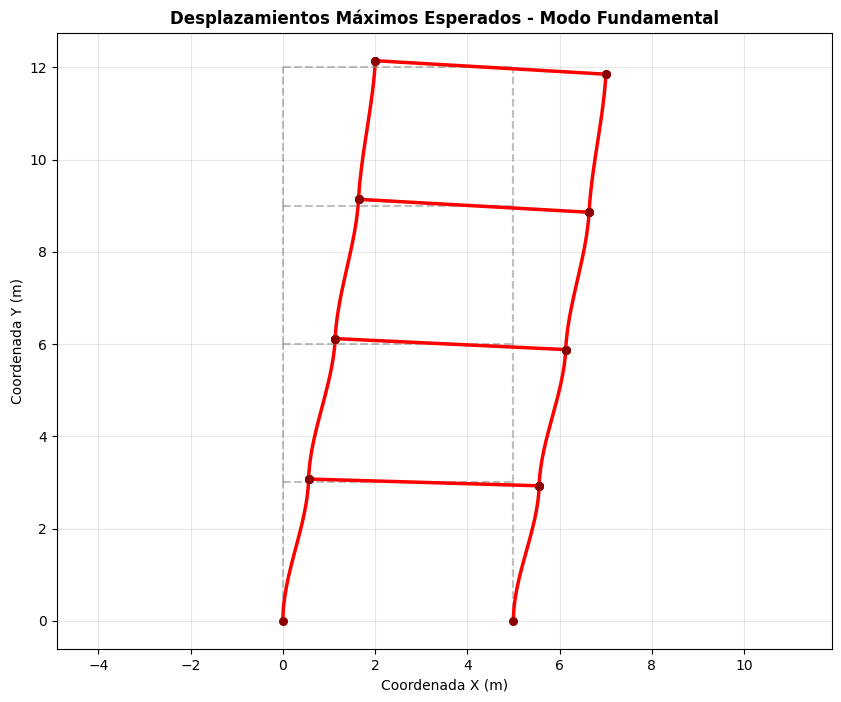
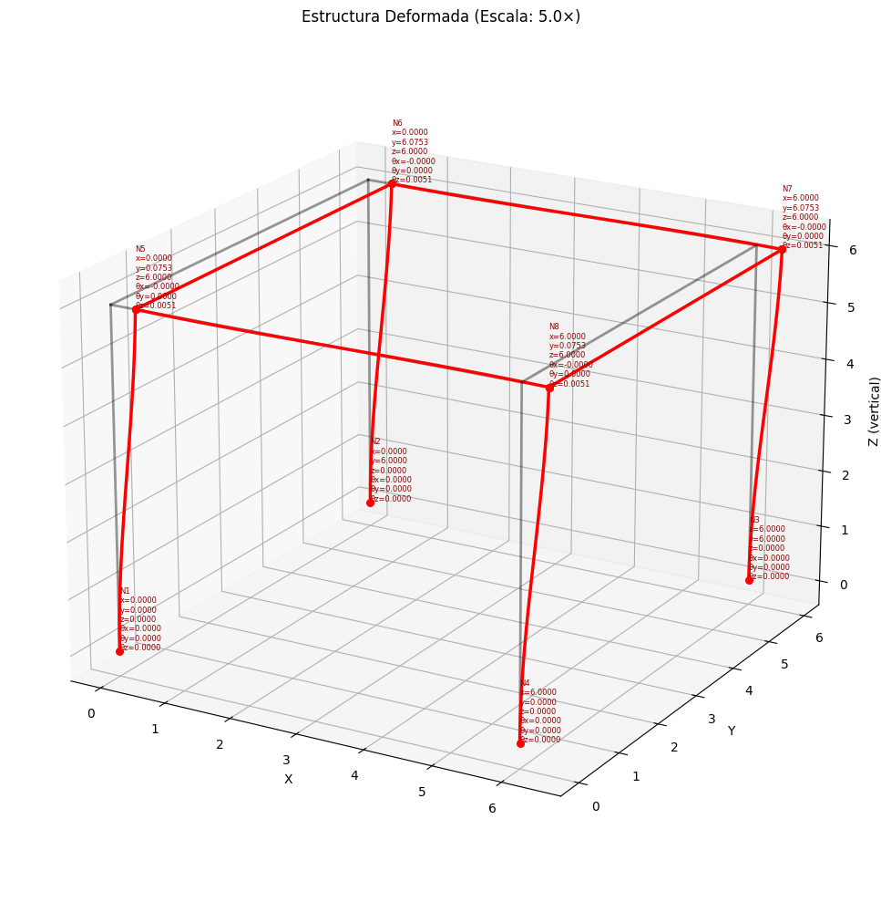

# 🏗️ Analisis Modal Espectral: Porticos 2D & 3D

Este repositorio contiene un motor de cálculo matricial para el análisis sísmico de estructuras (pórticos 2D y 3D) escrito en Python, el cual está integrado de forma nativa con **PyPst**, una librería personalizada para la generación automática de reportes de ingeniería utilizando **Typst**.

## 📖 Descripción del Proyecto

Este proyecto automatiza y documenta el cálculo estructural con un enfoque programático y de alta calidad visual. 
**Motor de Análisis Estructural (Python):** Implementa el método matricial de rigidez para pórticos en 2D y 3D. Incluye capacidades avanzadas como la condensación estática de Guyan para extraer la rigidez lateral y la ejecución de un **Análisis Modal Espectral**. Soporta espectros de diseño basados en normativas como la NEC (Ecuador) y la ASCE 7-16.

## ✨ Características Principales

### Análisis Estructural
* **Ensamblaje Matricial:** Cálculo de matrices de rigidez local y global, y vectores de fuerzas.
* **Dinámica de Estructuras:** Condensación de GDL sin masa, cálculo de frecuencias, periodos y modos de vibración.
* **Análisis Sísmico Espectral:** Superposición modal mediante reglas SRSS y ABS. Obtención de cortantes basales, desplazamientos y fuerzas estáticas equivalentes.
* **Visualización:** Ploteo automático de la deformada elástica y diagramas de fuerzas internas (axial, cortante, momento).

